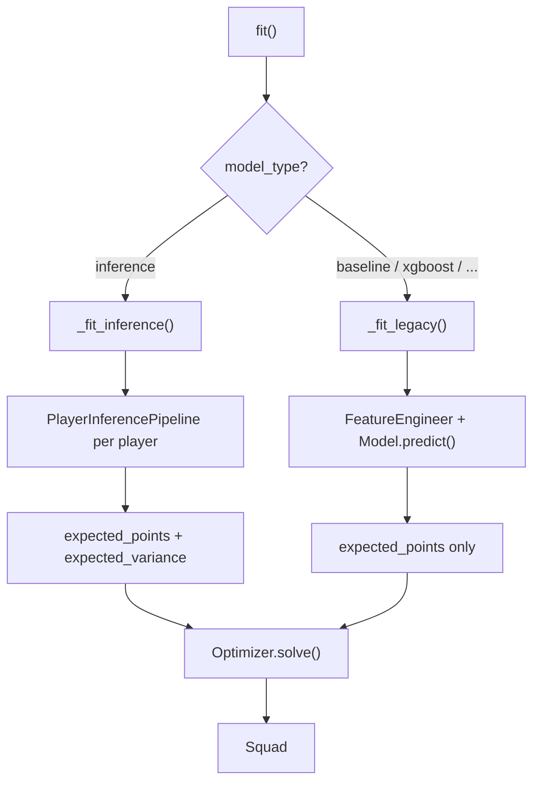

# Architecture

## Package Map

```
fplx/
├── api/              High-level orchestrator
│   └── interface.py      FPLModel: load_data → fit → select_best_11
│
├── core/             Domain objects
│   ├── player.py         Player dataclass (id, name, team, position, price, timeseries)
│   ├── squad.py          Squad dataclass with formation validation
│   └── matchweek.py      Gameweek context
│
├── data/             Data layer
│   ├── loaders.py        FPL API client, CSV loader, player enrichment
│   ├── news_collector.py Per-gameweek news snapshot persistence
│   └── schemas.py        Pydantic validation schemas
│
├── inference/        Probabilistic inference (core contribution)
│   ├── hmm.py            HMM: Forward, Forward-Backward, Viterbi, Baum-Welch
│   ├── kalman.py         1D Kalman Filter with adaptive noise + RTS smoother
│   ├── fusion.py         Inverse-variance weighting
│   └── pipeline.py       Per-player orchestrator with signal injection
│
├── models/           Prediction models
│   ├── baseline.py       Rolling mean, EWMA, form-based heuristics
│   ├── regression.py     Ridge, XGBoost, LightGBM with rolling CV
│   ├── ensemble.py       Weighted & adaptive ensemble
│   └── rolling_cv.py     Time-aware cross-validation
│
├── selection/        Squad optimization
│   ├── constraints.py    Formation, budget, team diversity
│   └── optimizer.py      Greedy & ILP (PuLP)
│
├── signals/          External signal processing
│   ├── news.py           Text → availability / risk / confidence
│   ├── fixtures.py       Fixture difficulty & congestion
│   └── stats.py          Weighted statistical scoring
│
├── timeseries/       Feature engineering
│   ├── transforms.py     Rolling, lag, EWMA, trend, consistency
│   └── features.py       Pipeline producing 40+ features
│
└── utils/            Configuration & validation
    ├── config.py         Nested config with dot-notation
    └── validation.py     Data quality checks & imputation
```

## Two Execution Paths

`FPLModel.fit()` dispatches based on `config["model_type"]`:



## Lazy Initialization

All components use the `@property` pattern — instantiated on first access:

```python
self._data_loader = None
self._news_collector = None
self._news_signal = None
# ...

@property
def news_collector(self):
    if self._news_collector is None:
        self._news_collector = NewsCollector(
            cache_dir=self.config.get("news_cache_dir")
        )
    return self._news_collector
```

This means unused components (e.g., `ILPOptimizer` when using greedy) are never instantiated and their optional dependencies (e.g., PuLP) are never imported.

## Constraint System

The ILP formulation:

$$\max \sum_i E[P_i] \cdot x_i$$

subject to:

$$\sum_i \text{cost}_i \cdot x_i \leq B \quad \text{(budget)}$$
$$\sum_{i \in \text{pos}} x_i \in [\text{min}, \text{max}] \quad \text{(formation)}$$
$$\sum_{i \in \text{team}} x_i \leq 3 \quad \text{(diversity)}$$
$$\sum_i x_i = 11, \quad x_i \in \{0, 1\}$$

Planned extension (mean-variance): replace objective with $\sum_i E[P_i] \cdot x_i - \lambda \sum_i \sqrt{\text{Var}[P_i]} \cdot x_i$, which remains linear in $x_i$ since $x_i$ is binary.
