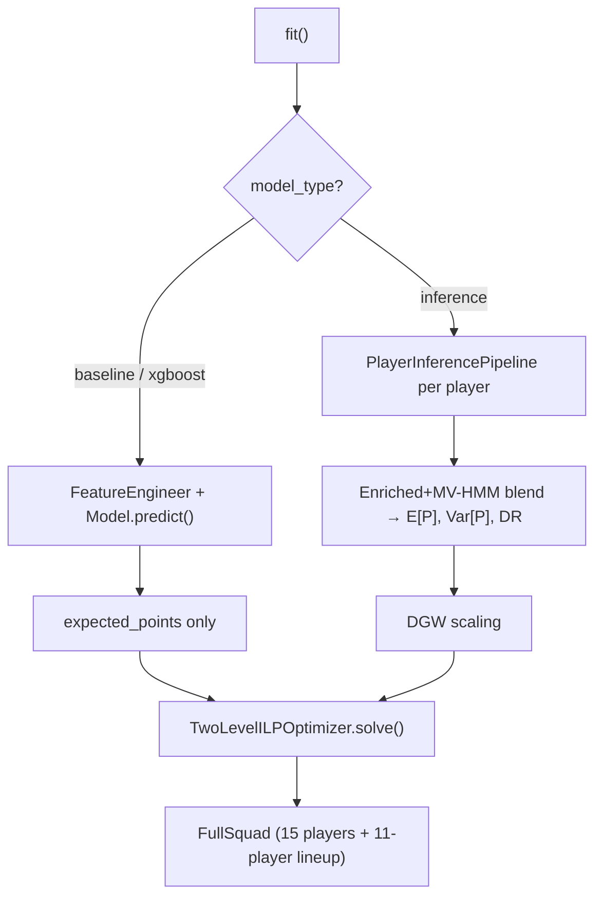

# Architecture

## Package Map

```
fplx/
├── api/
│   └── interface.py          FPLModel orchestrator
│
├── core/
│   ├── player.py             Player dataclass
│   ├── squad.py              Squad + FullSquad dataclasses
│   └── matchweek.py          Gameweek context
│
├── data/
│   ├── loaders.py            FPL API client + caching
│   ├── vaastav_loader.py     Historical dataset loader (vaastav/Fantasy-Premier-League)
│   ├── double_gameweek.py    DGW detection, timeseries aggregation, prediction scaling
│   ├── tft_dataset.py        Panel dataset builder for TFT
│   ├── news_collector.py     Per-gameweek news snapshot persistence
│   └── schemas.py            Pydantic validation schemas
│
├── evaluation/
│   ├── metrics.py            InferenceMetrics + OptimizationMetrics accumulators
│
├── inference/
│   ├── hmm.py                Scalar HMM: Forward, FB, Viterbi, Baum-Welch
│   ├── kalman.py             1D Kalman Filter with adaptive noise + RTS smoother
│   ├── multivariate_hmm.py   Position-specific MV-HMM with diagonal Gaussian emissions
│   ├── enriched.py           Feature-rich ridge predictor + semi-variance
│   ├── tft.py                TFT forecaster wrapper (quantile predictions)
│   ├── fusion.py             Inverse-variance weighting
│   └── pipeline.py           Per-player orchestrator with signal injection
│
├── selection/
│   ├── constraints.py        FormationConstraints, BudgetConstraint, TeamDiversityConstraint
│   ├── optimizer.py          TwoLevelILPOptimizer + GreedyOptimizer
│   ├── lagrangian.py         LagrangianOptimizer (subgradient dual ascent on budget constraint)
│   └── base.py               BaseOptimizer ABC
│
├── signals/
│   ├── news.py               Text → availability / minutes_risk / confidence
│   ├── fixtures.py           Fixture difficulty + congestion signals
│   └── stats.py              Weighted statistical scoring
│
├── timeseries/
│   ├── transforms.py         Rolling, lag, EWMA, trend, consistency
│   └── features.py           FeatureEngineer pipeline (40+ features)
│
└── utils/
    ├── config.py             Nested Config with dot-notation access
    └── validation.py         Data quality checks + imputation

scripts/
├── backtest_season.py        Full walk-forward backtest (inference + optimization)
├── train_tft.py              TFT training script
└── fetch_live_gw.py          Live gameweek deployment (FPL API → squad selection)
```

## Two-Level ILP Architecture

The optimizer solves a single joint problem for both squad and lineup:

```
Level 1: 15-player squad   (s_i ∈ {0,1})
  ├── Budget ≤ £100m        (applied to squad, not lineup)
  ├── Position quotas:       2 GK, 5 DEF, 5 MID, 3 FWD
  └── Team diversity:        max 3 from any club

Level 2: 11-player lineup  (x_i ∈ {0,1}, x_i ≤ s_i)
  ├── Lineup size = 11
  ├── 1 GK, 3–5 DEF, 2–5 MID, 1–3 FWD
  └── Objective: max Σ (μ̂_i − λ·ρ_i) · x_i
```

where `ρ_i = sqrt(σ̂²_i)` (mean-variance) or `ρ_i = σ̂⁻_i` (semi-variance).

## Double Gameweek Handling

DGW handling has a single entry point in the data layer:

```mermaid
graph LR
    RAW[Per-fixture rows] --> AGG[aggregate_dgw_timeseries\nauto-called in build_player_objects]
    AGG -->|one row / GW\npoints_norm| INF[Inference pipeline\nDGW-agnostic]
    INF -->|per-fixture E[P], Var| SC[scale_predictions_for_dgw\n× n_fixtures before ILP]
    SC --> ILP[Two-Level ILP]
```

Inference components never see raw multi-row DGW data.
The only DGW-aware step after the data layer is the ILP scaling call.

## Lazy Initialization

All components use the `@property` pattern — instantiated on first access:

```python
@property
def data_loader(self):
    if self._data_loader is None:
        self._data_loader = FPLDataLoader(**self.config.get("data_loader", {}))
    return self._data_loader
```

## Execution Paths


