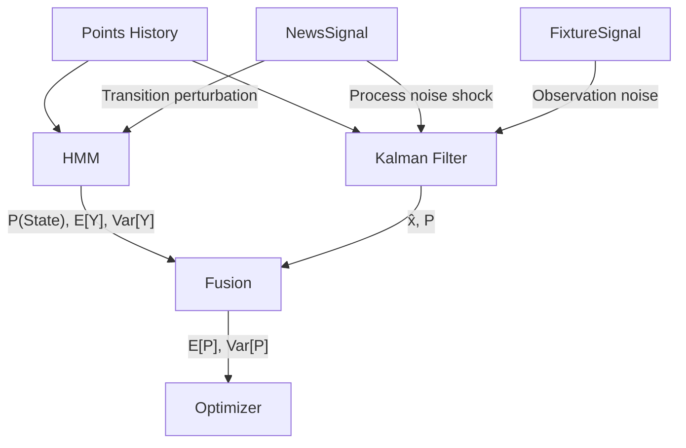

# Inference Pipeline

The core contribution of FPLX. Each player is modeled independently through a dual-filter system that tracks both discrete form states and continuous point potential.

## Overview



## Hidden Markov Model

The HMM tracks 5 discrete form states. Each state has a Gaussian emission model defining the expected points distribution.

| State | Mean | Std | Interpretation |
|-------|------|-----|----------------|
| Injured | 0.5 | 0.5 | Out or minimal cameo |
| Slump | 2.0 | 1.0 | Playing but underperforming |
| Average | 4.0 | 1.5 | Typical output |
| Good | 6.0 | 1.5 | Above-average returns |
| Star | 8.5 | 2.0 | Exceptional gameweek |

States are "sticky" — the default transition matrix has high self-transition probabilities (0.50–0.60) with gradual drift between adjacent states.

### Algorithms

| Algorithm | What it computes | Use case |
|-----------|-----------------|----------|
| Forward | $P(S_t \mid y_{1:t})$ | Online filtering |
| Forward-Backward | $P(S_t \mid y_{1:T})$ | Smoothed posteriors, fusion input |
| Viterbi | Most likely state sequence | Visualization, diagnostics |
| Baum-Welch | Learns $A$, $\mu$, $\sigma$ from data | Parameter training |

### News Perturbation

When news is injected at timestep $t$, the transition matrix for that timestep is modified:

$$A_t[i, j] = A[i, j] \times \big(1 + c \cdot (b_j - 1)\big)$$

where $b_j$ is the boost factor for target state $j$ and $c$ is the news confidence. The row is then renormalized. This means even from the Star state, an "unavailable" signal makes transitioning to Injured 10× more likely — but the observation evidence still has a say.

## Kalman Filter

Tracks a continuous latent variable $x_t$ representing the player's true point potential via a random-walk model:

$$x_{t+1} = x_t + w_t, \quad w_t \sim \mathcal{N}(0, Q_t)$$
$$y_t = x_t + v_t, \quad v_t \sim \mathcal{N}(0, R_t)$$

The filter produces minimum-MSE estimates $\hat{x}_t$ and posterior variance $P_t$ at each timestep.

### Adaptive Noise

Both $Q_t$ and $R_t$ can be overridden per-timestep by external signals:

| Signal | Parameter | Effect |
|--------|-----------|--------|
| Injury news | $Q_t = Q \times 5.0$ | Form may have jumped; widen state uncertainty |
| Doubtful news | $Q_t = Q \times 2.0$ | Moderate form uncertainty |
| Easy fixture | $R_t = R \times 0.8$ | Points more predictable, trust observation more |
| Hard fixture | $R_t = R \times 1.5$ | Points less predictable, trust prior more |

!!! info "Kalman Gain Interpretation"
    When $Q_t$ is large, the Kalman gain $K$ increases — the filter trusts the next observation more (prior is wide). When $R_t$ is large, $K$ decreases — the filter trusts the prior more (observation is noisy).

## Fusion

The HMM and Kalman Filter outputs are combined via inverse-variance weighting:

$$\mu_{\text{fused}} = \frac{\sigma^2_{KF} \cdot \mu_{HMM} + \sigma^2_{HMM} \cdot \mu_{KF}}{\sigma^2_{HMM} + \sigma^2_{KF}}$$

$$\sigma^2_{\text{fused}} = \frac{1}{1/\sigma^2_{HMM} + 1/\sigma^2_{KF}}$$

The fused variance is always $\leq \min(\sigma^2_{HMM}, \sigma^2_{KF})$: combining two estimates always reduces uncertainty.

!!! warning "Independence Assumption"
    This assumes the HMM and KF estimates are independent. They share the same observation sequence, so this is approximate. The approximation is acceptable because the HMM captures discrete regime structure while the KF captures continuous trends — they extract different information from the same data.

## Usage

```python
from fplx.inference.pipeline import PlayerInferencePipeline
from fplx.signals.news import NewsSignal

pipeline = PlayerInferencePipeline(
    kf_params={"Q": 1.0, "R": 4.0, "x0": 4.0, "P0": 2.0}
)

pipeline.ingest_observations(points_array)
pipeline.inject_news(
    NewsSignal().generate_signal("Ruled out for 3 weeks"),
    timestep=20
)
pipeline.inject_fixture_difficulty(difficulty=4.5, timestep=21)

result = pipeline.run()
ep_mean, ep_var = pipeline.predict_next()
```

The `InferenceResult` object contains all intermediate outputs: filtered beliefs, smoothed posteriors, Viterbi path, Kalman estimates, and fused sequences.
