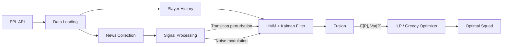

# FPLX

**Stochastic Inference & Constrained Optimization for Fantasy Premier League**

FPLX treats FPL squad selection as a dynamic decision problem under uncertainty. It models each player's form as a latent variable, fuses noisy evidence via probabilistic filters, and feeds the resulting distributions into a constrained optimizer.

-   :material-rocket-launch:{ .lg .middle } **Getting Started**

    ---

    Install FPLX and run your first squad selection in minutes.

    [:octicons-arrow-right-24: Installation](getting-started/installation.md)

-   :material-brain:{ .lg .middle } **Inference Pipeline**

    ---

    How the HMM + Kalman Filter fusion works, and how news signals inject into the inference.

    [:octicons-arrow-right-24: Pipeline Guide](guides/inference-pipeline.md)

-   :material-api:{ .lg .middle } **API Reference**

    ---

    Auto-generated documentation for every module, class, and function.

    [:octicons-arrow-right-24: API Docs](api/index.md)

-   :material-test-tube:{ .lg .middle } **Examples**

    ---

    Runnable scripts that hit the live FPL API and exercise every component.

    [:octicons-arrow-right-24: Examples](examples.md)

## System Overview

## Three Layers

| Layer | Components | Role |
|-------|------------|------|
| **Perceive** | `NewsSignal`, `FixtureSignal`, `NewsCollector` | Parse news text, fixture difficulty, collect per-gameweek snapshots |
| **Infer** | `HMMInference`, `KalmanFilter`, `fuse_estimates` | Track latent form states, continuous point potential, fuse with uncertainty |
| **Act** | `GreedyOptimizer`, `ILPOptimizer` | Select optimal squad under budget, formation, and team constraints |
