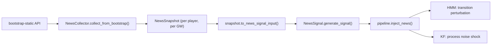

# News Signals

FPLX uses news data from the FPL API itself, no external scraping required.

## Data Source

Every player in the `bootstrap-static` API response includes:

| Field | Example | Type |
|-------|---------|------|
| `news` | `"Knee injury - expected back 01 Feb"` | `str` |
| `status` | `"i"` | `str`: `a`, `d`, `i`, `s`, `u`, `n` |
| `chance_of_playing_next_round` | `25` | `int` or `None` |
| `chance_of_playing_this_round` | `0` | `int` or `None` |
| `news_added` | `"2026-01-20T10:00:00Z"` | `str` |

Your existing `FPLDataLoader.fetch_bootstrap_data()` already fetches this. The `NewsCollector` extracts and persists it per gameweek.

## Data Flow



## NewsSignal Output

`NewsSignal.generate_signal(text)` returns:

```python
{
    "availability": 0.0,     # 0.0 (out) to 1.0 (available)
    "minutes_risk": 0.0,     # 0.0 (no risk) to 1.0 (high risk)
    "confidence": 0.9,       # 0.4 (vague) to 0.9 (definitive)
    "adjustment_factor": 0.0  # availability × (1 - minutes_risk)
}
```

The `adjustment_factor` is used by the legacy pipeline. The inference pipeline uses all four fields.

## Perturbation Mapping

The pipeline classifies each signal into a category, then maps to specific perturbations:

| Category | Trigger | HMM Boost | KF Q Multiplier |
|----------|---------|-----------|-----------------|
| **Unavailable** | `"ruled out"`, status=`i` | Injured ×10, Slump ×2 | 5.0 |
| **Doubtful** | `"late fitness test"`, status=`d` | Injured ×3, Slump ×2 | 2.0 |
| **Rotation** | `"rotation risk"`, `"benched"` | Slump ×2, Average ×1.5 | 1.5 |
| **Positive** | `"back in training"` | Good ×2, Star ×1.5 | 1.0 |
| **Neutral** | No news, status=`a` | No change | 1.0 |

## NewsSnapshot Enrichment

`NewsSnapshot.to_news_signal_input()` combines raw news text with structured fields for richer parsing:

```python
# Raw API data
news_text = "Hamstring injury - expected back 01 Feb"
status = "i"
chance_next = 25  # percent

# Enriched text fed to NewsSignal
# → "Hamstring injury - expected back 01 Feb. Status: injured. 25% chance of playing"
```

This gives `NewsParser` more signal than the raw text alone.

## Per-Gameweek Persistence

`NewsCollector` saves snapshots to `~/.fplx/news/gw{NN}.json`. This enables backtesting: replay a full season's news week by week to validate the inference pipeline against historical data.

```python
from fplx.data.news_collector import NewsCollector

collector = NewsCollector(cache_dir="~/.fplx/news")

# Collect current state
collector.collect_from_bootstrap(bootstrap_data, gameweek=25)

# Retrieve later (loads from disk)
snapshot = collector.get_player_news(player_id=301, gameweek=25)
flagged = collector.get_players_with_news(gameweek=25)
history = collector.get_player_history(player_id=301)  # all GWs
```
